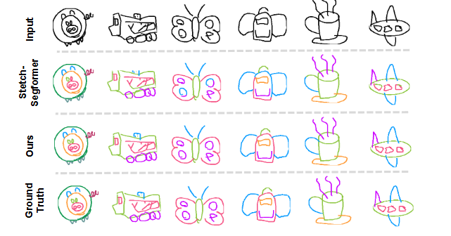

# ContextSeg-PyTorch

[](https://www.python.org/downloads/)
[](https://pytorch.org/)
[](https://opensource.org/licenses/MIT)

這是一個基於 PyTorch 的 **[ContextSeg: Sketch Semantic Segmentation by Querying the Context with Attention](https://arxiv.org/abs/2311.16682)** 論文的完整實現版本。本專案旨在完整復現並優化原論文的兩階段方法，以實現對手繪草圖的精準語義部件分割。



---

## ✨ 專案亮點

此專案將原始的 TensorFlow 程式碼完全轉換為 PyTorch，並進行了以下核心改進：

- **✅ 現代化框架**：所有模型架構、訓練迴圈和資料載入器都已從 TensorFlow/Keras 轉換為 PyTorch，更易於除錯與擴展。
- **📦 高效資料管道**：移除了對 `tfrecord` 的依賴，改用 PyTorch 原生的 `.pt` 格式儲存預處理資料，徹底解決了 TensorFlow 版本衝突問題，並提升了資料讀取效率。
- **📝 忠於論文實現**：根據論文補充了官方原始碼中未實現的關鍵細節，包括：
  - **Focal Loss**：用於解決部件類別不平衡問題。
  - **Scheduled Sampling**：動態調整 Teacher Forcing 比例，縮小訓練與推論的差距。
  - **動態學習率**：引入 `ReduceLROnPlateau` 排程器，使訓練過程更智慧。
- **🔧 增強的訓練腳本**：提供了更穩健的訓練、續訓、測試與視覺化流程，並包含詳細的日誌與 TensorBoard 監控。

## ⚙️ 架構總覽

本專案嚴格遵循論文的兩階段架構：

1.  **階段一：筆劃嵌入網路 (Stroke Embedding Network)**

    - 訓練一個通用的 `AutoencoderEmbed` 模型，學習將單個筆劃或筆劃組的圖像編碼為高品質的特徵向量 (Embedding)。此階段會使用所有類別的資料。

2.  **階段二：分割 Transformer (Segmentation Transformer)**
    - 固定第一階段的編碼器權重，將其作為特徵提取器。
    - 訓練一個 `GpTransformer` 模型，它以自迴歸 (Auto-regressive) 的方式，根據筆劃嵌入的上下文來預測各個語義部件。此階段針對每個類別單獨訓練。

## 🚀 快速開始

請依照以下步驟來設定環境、預處理資料並進行模型訓練。

### 1. 複製專案

```bash
git clone <your-repository-url>
```

### 2. 環境設定

建議使用 **Python 3.11** 或更新版本，並建立一個虛擬環境。

```bash
# 建立並啟用虛擬環境 (推薦)
python -m venv venv
source venv/bin/activate  # On Windows, use `venv\Scripts\activate`

# 安裝所有必要的 Python 套件
pip install torch torchvision numpy==1.26.4 Pillow ujson opencv-python==4.8.1.78 tensorboard albumentations tqdm GeodisTK
```

> **⚠️ 注意**：
>
> - `numpy` 建議安裝 `1.x` 版本 (`<2`) 以確保與某些相依套件的最佳相容性。
> - `torch` 的安裝指令可能需要根據您的 CUDA 版本進行調整。請參考 [PyTorch 官網](https://pytorch.org/get-started/locally/) 的說明。

### 3. 下載並準備資料集

1.  手動建立一個 `data/` 資料夾。
2.  從以下連結下載原始資料集，並將其 `.ndjson` (或 `.json`) 檔案放入 `data/` 資料夾中。
    - [SPG Dataset (於 SketchX 中)](https://github.com/KeLi-SketchX/SketchX-PRIS-Dataset)
    - [CreativeSketch Dataset](https://songweige.github.io/projects/creative_sketech_generation/gallery_creatures.html)

### 4. 預處理資料

執行以下兩個腳本來生成 PyTorch (`.pt`) 格式的訓練檔案。

```bash
# 為第一階段的嵌入網路準備資料 (合併所有類別)
python write_data_embed.py

# 為第二階段的分割網路準備資料 (逐一類別)
python write_data_former.py
```

執行完畢後，您應該會在根目錄看到 `data_embed_pt/` 和 `data_former_pt/` 兩個資料夾。

### 5. 訓練筆劃嵌入網路 (階段一)

執行以下指令來訓練 `AutoencoderEmbed` 模型。

```bash
python train_Embed.py --dbDir data_embed_pt_k_0001 --outDir result_embed --status train
```

訓練完成後，最佳的模型權重將儲存在 `result_embed/` 下的子目錄中（例如 `_2025.../checkpoints/best_acc_model.pth`）。

<details>
<summary><b>點此展開：進階選項 (續訓、測試等)</b></summary>

- **從 Checkpoint 恢復訓練**:
  ```bash
  python train_Embed.py --dbDir data_embed_pt_k_0001 --outDir result_embed --status train --ckpt path/to/your/checkpoint.pth --cnt
  ```
- **測試模型性能**:
  ```bash
  python train_Embed.py --status test --ckpt path/to/your/best_model.pth
  ```
- **生成視覺化重建圖**:
  ```bash
  python train_Embed.py --status vis --ckpt path/to/your/best_model.pth
  ```

</details>

### 6. 訓練分割 Transformer (階段二)

使用第一階段產生的權重來訓練 `GpTransformer` 模型。

```bash
# (重要) 請務必將 --embed_ckpt 指向你在步驟 5 中得到的最佳模型權重
python train_Segformer.py --dbDir data_former_pt --outDir result_segformer --status train --embed_ckpt result_embed/_.../checkpoints/best_acc_model.pth
```

<details>
<summary><b>點此展開：進階選項 (續訓、測試等)</b></summary>

- **從 Checkpoint 恢復訓練**:
  ```bash
  python train_Segformer.py --dbDir data_former_pt --outDir result_segformer --status train --embed_ckpt path/to/embed_model.pth --ckpt path/to/segformer_checkpoint.pth --cnt
  ```
- **測試模型性能**:
  ```bash
  python train_Segformer.py --status test --embed_ckpt path/to/embed_model.pth --ckpt path/to/your/best_segformer_model.pth
  ```

</details>

## 引用

如果您在研究中使用了這個專案，請考慮引用原作者的論文：

```bibtex
@article{wang2023contextseg,
  title={ContextSeg: Sketch Semantic Segmentation by Querying the Context with Attention},
  author={Wang, Jiawei and Li, Changjian},
  journal={arXiv preprint arXiv:2311.16682},
  year={2023}
}
```
